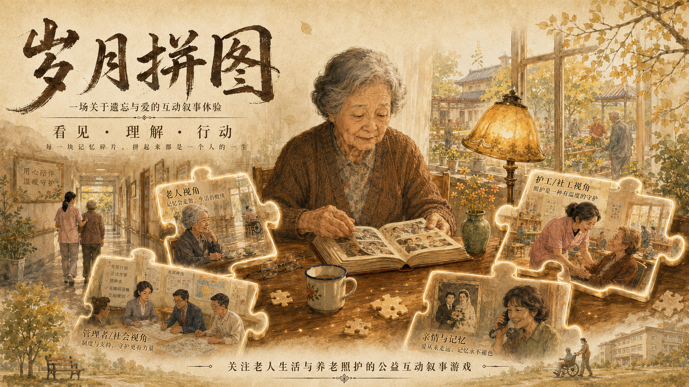
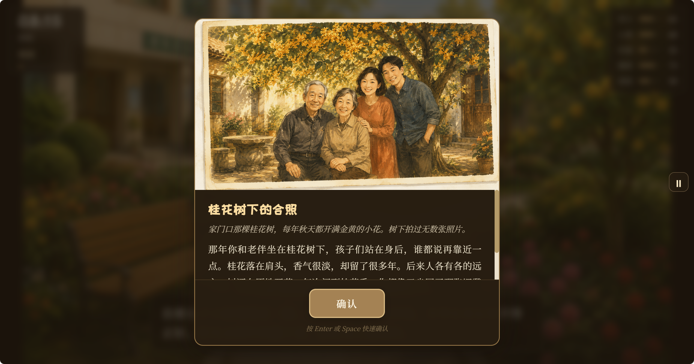
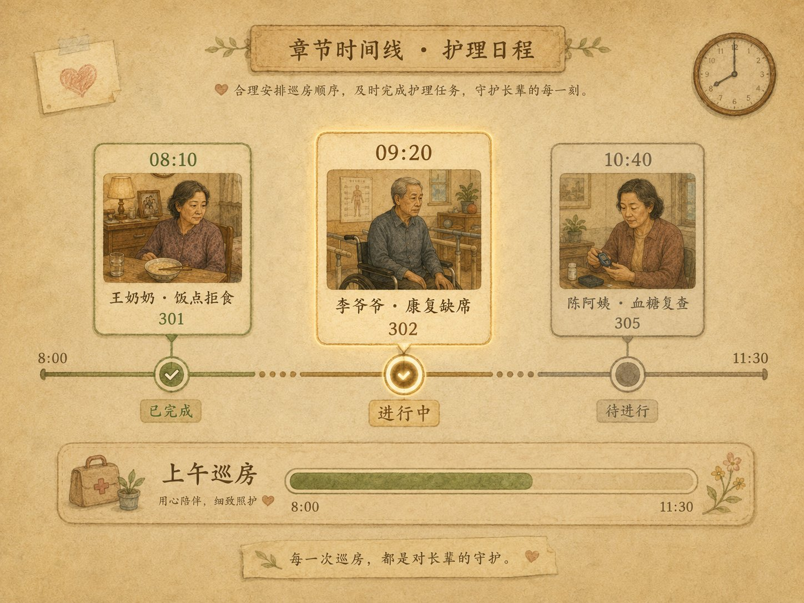
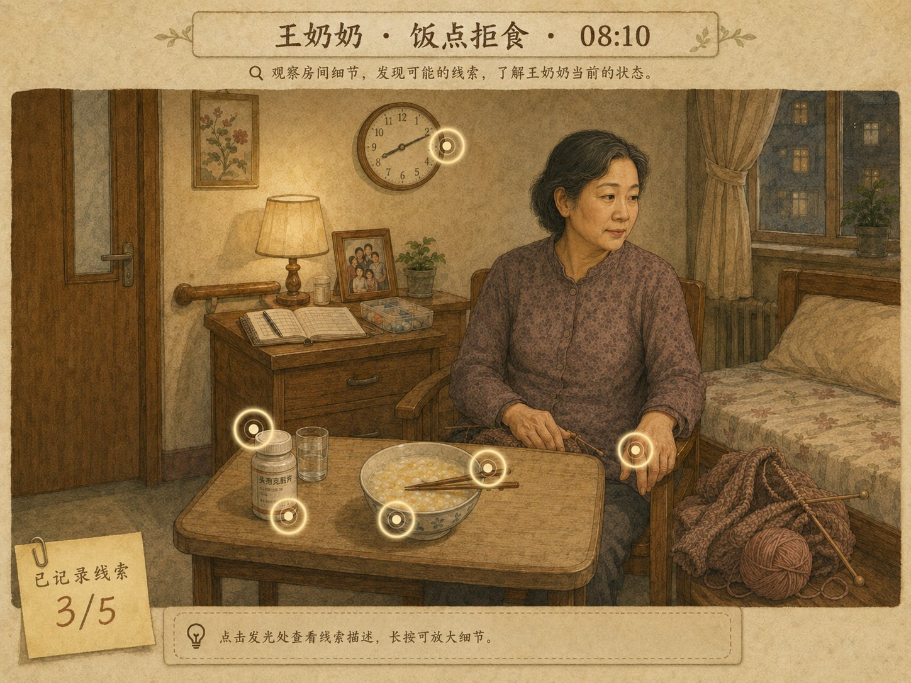
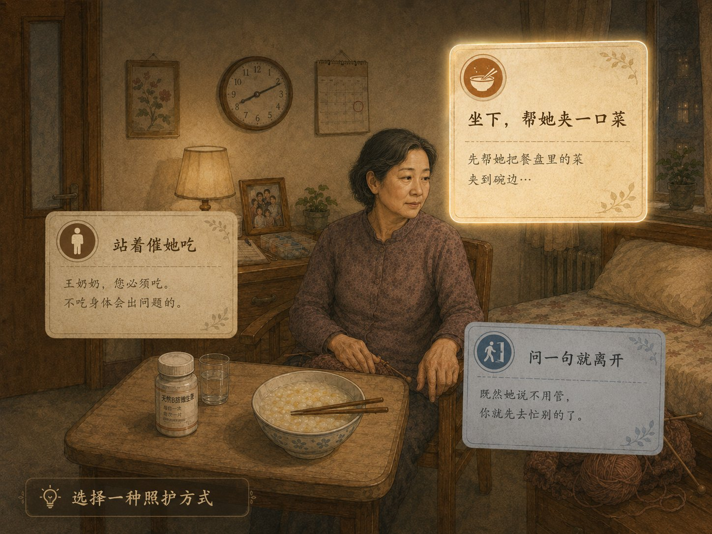
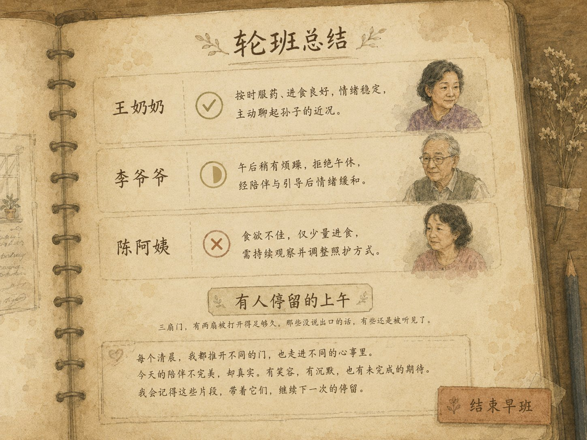
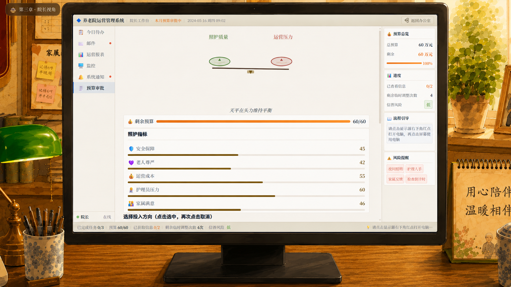
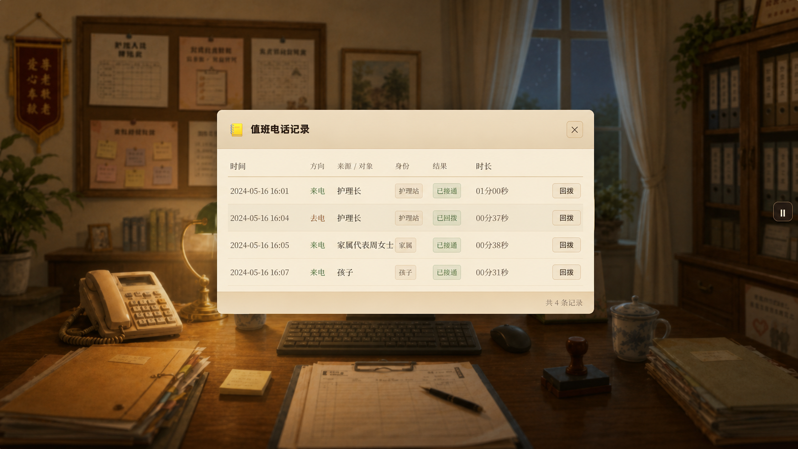
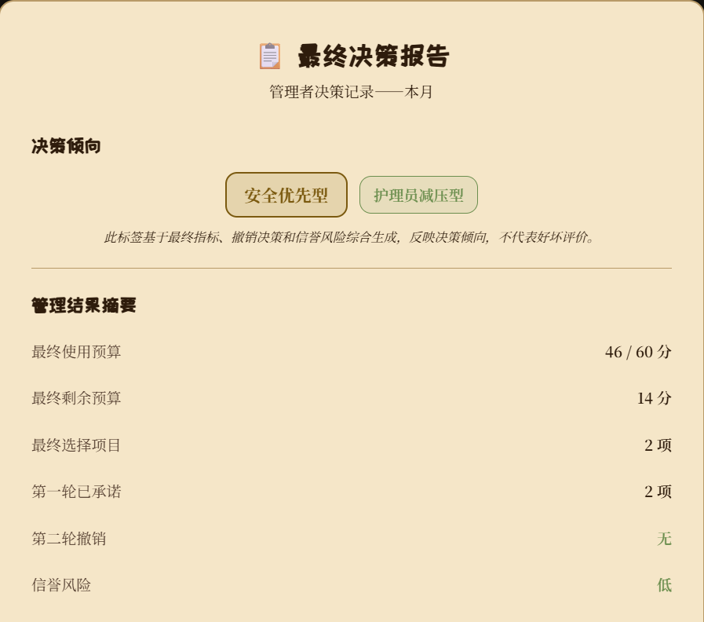
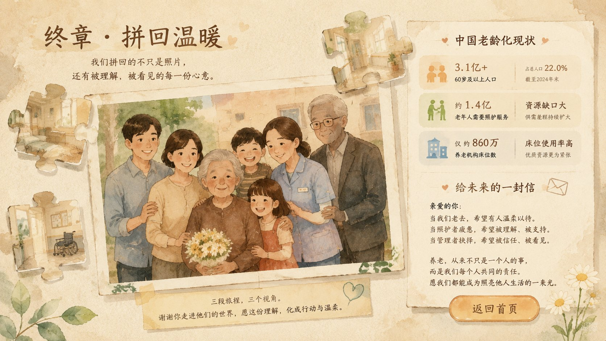

# 岁月拼图 (Puzzle of Time)

> 适老化关怀公益互动体验 —— 在三个角色视角的切换中，感受衰老、照护压力与资源分配的艰难取舍。

<p align="center">
  
</p>

---

## 项目简介

《岁月拼图》是一款以**适老化关怀**为主题的互动体验网页应用。玩家依次扮演**老人、护工、院长**三种角色，在逐步解锁的章节中，从不同维度理解养老困境：

| 章节 | 视角 | 核心体验 | 设计意图 |
|------|------|----------|----------|
| 第一章 | 🧓 老人 | 全屏场景探索，24小时生活模拟 | 感受衰老带来的身体衰退与记忆流失 |
| 第二章 | 📋 护工 | 上午巡房，场景观察 + 空间干预 | 体验照护工作中的时间压力与情感消耗 |
| 第三章 | ⚖️ 院长 | 办公室管理，预算分配与突发事件处理 | 面对资源有限下的艰难取舍 |

三章全部通关后，进入**终章**——拼回完整照片，展示公益数据，呼吁社会行动。

---

## 作品背景

中国正以人类历史上前所未有的速度步入老龄化社会。截至 2024 年末，60 岁以上人口已超过 3.1 亿，占总人口的 22%。这意味着每 5 个中国人中，就有 1 位老人。而更严峻的是——绝大多数人从未真正「体验」过衰老，也没有机会站在照护者和管理者的视角去理解养老困局。

《岁月拼图》的创作初衷，正是用**互动体验**架起一座理解的桥：

- **衰老不是数字**：当视野模糊、脚步迟缓、记忆碎片散落——衰老是一种「身体体验」，而非统计报表上的百分比。
- **照护不是口号**：护工人手永远不够，必然有照顾不到的人和事。那些「未说出口的需求」，需要用观察和耐心去发现。
- **资源永远有限**：院长手中的 60 分预算，每一个投入方向都意味着另一个方向的牺牲。现实中没有完美的方案。

本作不提供答案，只提供 **「选择的重量」**——希望玩家在三次视角切换中，对老龄化议题产生更深的共情与思考。

---

## 核心玩法

### 第一章 · 老人视角 —— 在养老院度过一天

玩家扮演一位住在养老院的老人，从清晨 6 点到次日清晨 6 点，在 8 个场景（房间、走廊、餐厅、活动室、花园、医务室、护理站、电话角）之间自由探索。37 个互动事件遍布各个角落：靠在床边翻旧相册、在花园晒太阳、去电话角给家人拨一通电话、用平板发起视频通话、坐在餐厅里等护工送来热腾腾的饭菜……

但衰老如影随形。五维状态——**体力、心情、饥饿、健康、孤独感**——实时流逝：饿久了会晕倒，体力耗尽时护工会赶来扶着坐下，孤独久了会陷入消极。没戴老花镜时，整个画面会逐渐模糊；体力过低时，每走一步都更慢、更费时间。

40 个随机事件贯穿一天：10 个随时间流逝自然触发的被动事件——晨光落在被角、走廊飘来粥香、午后犯困、晚风变凉、走廊灯亮了；8 个场景进入偶遇——纸牌声从活动室传来、小白板上写着你的名字、平板屏幕亮了一下；还有 22 个原有的互动反馈事件。所有被动事件受全局冷却和每日总量控制，走在通知栈顶部，不打断玩家的操作节奏。

21 个回忆碎片散落在互动中——翻旧相册可能翻到泛黄的全家福，打电话可能听见孙子的笑声，在花园晒太阳可能想起年轻时种过的花。当天结束时，系统会根据你的状态、选择和收集的碎片，匹配 14 种结局 CG 之一：危机优先，主题匹配，最后综合兜底。

> **核心机制**：五维状态、老花镜模糊、时段光照、体力惩罚与耗尽干预、40 个随机事件（含时间流逝+场景进入）、通知栈、回忆碎片收集、14 结局多结局系统、平板视频通话、护工呼叫铃、餐厅专属聊天。

### 第二章 · 护工视角 —— 看见「未说出口的需求」

你是一名轮班护工，上午的排班里逐位照护三位老人：王奶奶、李爷爷、陈阿姨。每位老人都有隐藏的「真实需求」——表面行为未必是真相。

照护流程：**入场介绍 → 观察线索 → 老人发出信号 → 选择干预方式**。观察环节中，桌子上的筷子在碗沿发颤——不一定是没胃口，可能是手抖夹不起来；老人扶着墙却不拿拐杖——不一定是懒，可能是怕被人看见自己一瘸一拐；血糖仪屏幕亮着，但本子上昨晚只记了「喝了碗汤」——不是忘了记录，是刻意少吃想让儿子放心。你需要从环境线索和行为细节中推断真相，在三个干预选项中做出选择。

轮班结束时，根据 3 次照护的成功/部分/失败结果，匹配对应的结局标签与回响文案。

> **核心机制**：场景热点观察 + 空间干预选择、三位老人各有真实需求、人不完美——必然有照顾不到的遗憾。

### 第三章 · 院长视角 —— 60 分预算的艰难天平

坐在院长办公室里，面前是电脑里的运营报表、公告栏上的待处理事件、随时响起的电话。你手握 **60 分预算**，需要在 6 个投入方向之间分配：安全保障、护理质量、老人生活、员工福利、设施维护、家属沟通。每一项都有真实的收益和代价。

提交第一轮预算后，突发事件接踵而至：护工离职潮、老人跌倒风险、家属投诉电话、上级检查通知……每个事件都让某些指标雪上加霜。中间还会接到家人的私人电话——不改变机构指标，却影响你的夜晚。

第二轮可以调整 2 次预算，但撤销之前的承诺会提高信誉风险。最终，系统生成决策报告：回顾你优先了什么、牺牲了什么、哪些指标亮起了红灯。

> **核心机制**：60 分预算分配、5 项指标联动、随机突发事件、家庭通话、两轮调整、最终决策报告。

### 终章 · 拼回温暖

三章通关后，三块碎片拼回一张完整的全家福照片。随后展示中国老龄化公益数据，以及一封写给你的呼吁信。

---

## 界面预览

### 第一章 · 老人视角 🧓

> 全屏场景探索。在 8 个场景间自由移动，触发互动、收集回忆碎片，经历 14 种不同的结局。

| 游戏中 | 回忆碎片 |
|--------|---------|
|  |  |

| 随机事件 | 结局 CG | 结局报告 |
|----------|--------|----------|
|  |  |  |

- 🏠 8 个可探索场景，7 个时段光照，从晨光到深夜
- 🕹️ 30+ 互动事件，22 个随机事件，20+ 回忆碎片
- 📊 体力 / 心情 / 饥饿 / 健康 / 孤独感 —— 五维状态实时变化
- 👓 老花镜、画面模糊、移动迟缓……衰老不是数字，是体验
- 🎬 14 种结局 CG，危机优先匹配，多结局共存

**设计意图：体验衰老的无力感，但也能在碎片中拼回温暖。**

---

### 第二章 · 护工视角 📋

> 「看见未说出口的」——轮班照护中，通过观察和干预，发现老人真正需要什么。

| 排班时间轴 | 观察场景 |
|-----------|---------|
|  |  |

| 干预选择 | 总结评估 |
|---------|----------|
|  |  |

- 🕐 上午巡房，3 个事件按时间线逐个推进
- 👴 三位老人各有故事与真实需求，表面行为未必是真相
- 🔍 观察 → 🩺 干预 → 📝 结果，线索驱动照护决策
- 🏆 结局由 3 次照护的成功/部分/失败结果决定

**设计意图：从第三视角出发，在多线索冲突中还原老人的真实行为动机。**

---

### 第三章 · 院长视角 ⚖️

> 「资源天平」——在院长办公室面对报表、突发危机和家庭压力，于有限预算中做抉择。

| 办公室场景 | 电脑系统 |
|-----------|---------|
|  |  |

| 预算审批 | 突发事件 | 决策报告 |
|----------|---------|----------|
|  |  |  |

- 🏢 点击办公室各区域：电脑查看报表、公告栏追踪事件、电话应对突发
- 💰 60 分预算，6 个投入方向，每项选择都有代价
- ⚡ 护工离职、跌倒风险、家属投诉、检查通知……随机突发
- 📞 家人的私人电话，不影响指标，却影响你的夜晚
- 📋 最终决策报告，回顾你优先了什么、牺牲了什么

**设计意图：没有任何方案能让所有指标达标。这就是公共养老的现实。**

---

### 终章

| 终章 |
|------|
|  |

三张碎片拼回照片。公益数据。一份给你的呼吁。

---

## 项目亮点

### 🎨 视觉风格：中国养老院复古绘本

40+ 张 ComfyUI（SDXL）生成的场景、碎片和结局 CG，统一采用**中国养老院复古绘本**风格——暖米色墙壁、浅木色地板、低饱和暖色调，配合水彩纹理和蜡笔线稿质感。7 个时段光照滤镜从清晨暖光过渡到深夜冷暗，场景随时间的流逝而变化。

### 🎮 三层递进的交互设计

不是单一角色的叙事游戏，而是三个视角的「接力体验」——从被照护者、照护者到管理者，层层递进，让玩家从不同维度理解养老议题的复杂性和多面性。

### 🕹️ 全屏场景探索 + 热点交互

老人章采用全屏场景探索模式，每个场景的交互热点严格按图片物体位置定位（百分比坐标系统），支持鼠标悬停高亮、触控放大、冷却显示等细节交互。v6.5 实现移动端自适应放缩，热点按钮随屏幕宽度自动缩放。

### 🧩 碎片叙事系统

21 个回忆碎片分四类收集：相册翻页（8 个）、行为触发（3 个）、组合触发（8 个）、偶遇事件（2 个）。碎片之间有关联逻辑——某些碎片需要先收集其他碎片才能触发，拼凑出老人一生的故事拼图。

### ⚖️ 不可妥协的设计约束

三条硬性设计规则贯穿始终：老人不可完全取消衰老效果；护工不可把“不配合”直接等同于拒绝；院长不可让所有指标达标。这是作品的核心立场——**理解不完美，才是理解现实的开始**。

### 💾 完整的存档与进度系统

自动存档至浏览器 localStorage，支持章节进度恢复、旧版本存档迁移、设置持久化（字体大小三档切换、衰老效果开关、BGM 音量）。三章进度独立跟踪，完成情况在主页展示。

### 📱 移动端适配

v6.5 实现全模块移动端响应式适配。热点/出口按钮使用 `clamp()` + `vw` 实现视口自适应缩放，触控优化（禁止双击缩放、增强按下反馈），手机竖屏到桌面大屏均有良好的交互体验。

### 🏗️ 模块化架构设计

源码采用模块化架构：`elder` / `caregiver` / `manager` 三个独立模块，通过 `core/` 公共层通信。章节注册表动态加载，路由自动生成。模块间严格隔离，互不污染。完整的 TypeScript 类型系统覆盖。

---

## 运行

```bash
git clone https://cnb.cool/txl_XinFeiXiang/PuzzleofTime.git
cd PuzzleofTime
npm install
npm run dev        # 浏览器打开 http://localhost:5173
```

> 需 Node.js ≥ 20。纯前端应用，无需后端服务。

**其他命令：**

```bash
npm run build      # 构建到 dist/
npm run preview    # 预览构建结果
```

---

## 设计约束

三个章节各自承载一条不可妥协的设计意图：

- 🧓 **老人**：不可完全取消衰老效果。模糊、迟缓、遗忘是体验本身。
- 📋 **护工**：不可让所有事件完美解决。总有人和事被落下。
- ⚖️ **院长**：不可让所有指标达标。资源永远不够分。

---

## 制作

- 视觉由 ComfyUI (SDXL) 生成，风格为**中国养老院复古绘本**
- 所有场景图片为 1280×720，共 40+ 张场景/碎片/结局 CG
- 字体：Noto Serif SC + ZCOOL KuaiLe
- 技术：React + TypeScript + Vite，极简依赖

---

本作为公益目的开发。
